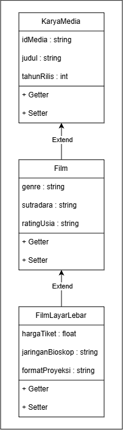

# TP2DPBO2425C1
TUGAS PRAKTIKUM 2 DPBO INHERITANCE

## ✊🏻 JANJI
Saya Irsyad Afif Musyaffa dengan NIM 2508023 mengerjakan Tugas Praktikum 2 dalam mata kuliah Desain Pemrograman Berorientasi Objek untuk keberkahan-Nya maka saya tidak akan melakukan kecurangan seperti yang telah di spesifikasikan.

## 👾 DESKRIPSI PROGRAM
Program ini menerapkan konsep *multilevel inheritance* dalam studi kasus **Katalog Media & Koleksi Film Bioskop** menggunakan pendekatan Pemrograman Berorientasi Objek (OOP).

Sistem memiliki hierarki 3 tingkat kelas:
1. **KaryaMedia**: *Base class* yang menyimpan identitas paling umum dari entitas media.
2. **Film**: Class turunan pertama (*extends* KaryaMedia) yang menambahkan informasi umum seputar entitas film.
3. **FilmLayarLebar**: Class turunan tingkat akhir (*extends* Film) yang memuat spesifikasi khusus untuk katalog film layar lebar (bioskop).

Repositori ini menyediakan implementasi dalam 4 bahasa pemograman:
- C++
- Java
- Python
- PHP

**Fitur & Ketentuan Utama:**
- Inisialisasi awal dengan 5 data *default*.
- Menu interaktif untuk menambah data baru (*add*).
- Output katalog ditampilkan menggunakan tabel CLI dinamis yang menyesuaikan panjang data terpanjang secara otomatis.
- Menampilkan informasi data dari class tingkat paling bawah (`FilmLayarLebar`).
- Khusus pada PHP, ditambahkan kemampuan penanganan atribut media/poster film.

## ❌ ERROR HANDLING
Program dilengkapi dengan mekanisme validasi input untuk menjaga integritas data:
- **Proteksi Tipe Data Numerik:** Memastikan entri berupa angka valid dan positif (misalnya pada input tahun rilis dan harga tiket). Jika input berupa teks/karakter non-numerik atau bernilai negatif, sistem memunculkan pesan error dan meminta input ulang hingga valid.
- **Validasi Keunikan ID:** Mencegah pendaftaran data baru dengan Kode ID yang sudah terpakai (*duplicate primary key*).

## 📐 DIAGRAM KONSEP

**Alasan Pemilihan Class:**
1. **KaryaMedia:** KaryaMedia merupakan class paling umum dalam katalog media, bukan hanya film saja melainkan bisa berupa musik atau buku. Oleh karena itu, atribut umum seperti `idMedia`, `judul`, dan `tahunRilis` diletakkan di class ini.
2. **Film:** Film merupakan kategori yang lebih khusus dari KaryaMedia. Menambahkan atribut spesifik film seperti `genre`, `sutradara`, dan `ratingUsia`.
3. **FilmLayarLebar:** FilmLayarLebar merupakan turunan dari Film. Mengambil spesifikasi khusus untuk film yang ditayangkan di bioskop komersial dengan atribut khas seperti `hargaTiket`, `jaringanBioskop`, dan `formatProyeksi`. 

## ☕️ CLASS & ATRIBUT
1. **KaryaMedia**
   - `idMedia` : string
   - `judul` : string
   - `tahunRilis` : int

2. **Film** *(extends KaryaMedia)*
   - `genre` : string
   - `sutradara` : string
   - `ratingUsia` : string

3. **FilmLayarLebar** *(extends Film)*
   - `hargaTiket` : float
   - `jaringanBioskop` : string
   - `formatProyeksi` : string

## 🍎 ALUR PROGRAM
1. Program memuat 5 data default/awal.
2. User dapat memilih opsi untuk menampilkan data/menambahkan data.
3. Semua data dapat ditampilkan di tabel dinamis.
4. User dapat menginput data baru.
5. Pada PHP dapat mengupload gambar ke atribut poster film.
6. Khusus di PHP, untuk merestart data dan kembali hanya 5 atribut awal bisa dilakukan dengan menekan tombol **Reset Data**.

## DOKUMENTASI PROGRAM
### C++

### Java

### Python

### PHP

